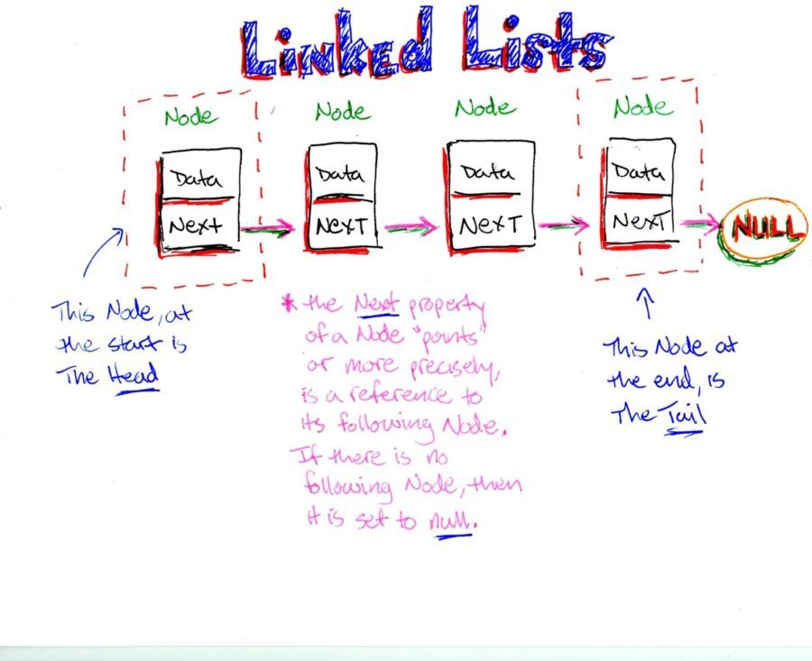
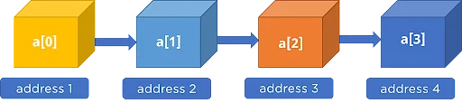
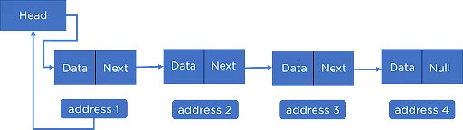
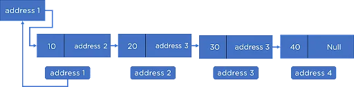

# More singly linked lists.

## Resources
### Read or watch:
* [google](https://intranet.alxswe.com/rltoken/2-7-eVuWcPutbXf6YZZgiA)
* [youtube](https://intranet.alxswe.com/rltoken/wVWwl86ufLMsXeAigpxllg)
## What Is a Singly Linked List in C?

A Singly linked list is a collection of data called nodes,
where each node is divided into two parts to store data and address at some random addresses.
The pointer next, points to the address of the next node in a list.

* **Compared to the array data structure, the size of the linked list elements is not fixed. Due to this,
  there is an efficient memory utilization in a singly linked list**

* **Implementing a singly linked list to perform operations like insertion and deletion is easy**

* **Elements are accessed easily in a singly linked list**
## Memory Representation of Singly Linked List

Let's consider four elements to insert into the list.

We have four nodes, each consisting of a data part and address part stored at some address. In the singly linked list,
we have a special node called the head node that holds the address of the first node, and the last node points to Null.

Every node in a linked list connects with the other through a pointer that points to the address of the next node,
and arrows in the above-given diagram represent that.

In a linked list, each node connects through a pointer that points to the address of its next node,
and arrows in the above-given diagram represent that.
### For Example:

**Let our elements to insert be 10, 20, 30, and 40.**
* The head node holds the address of the first node.
* The next part of the first node holds the address of the next node, address 2.
* Similarly, the second node holds the address of the third node, address 3.
* The third node holds the address of its next node, address 4. which follows till the last node that is pointing to the Null. In this way, they link together.
## Learning Objectives
**_How to use linked lists_**

**_Start to look for the right source of information without too much help_**